# Fern Ornaments

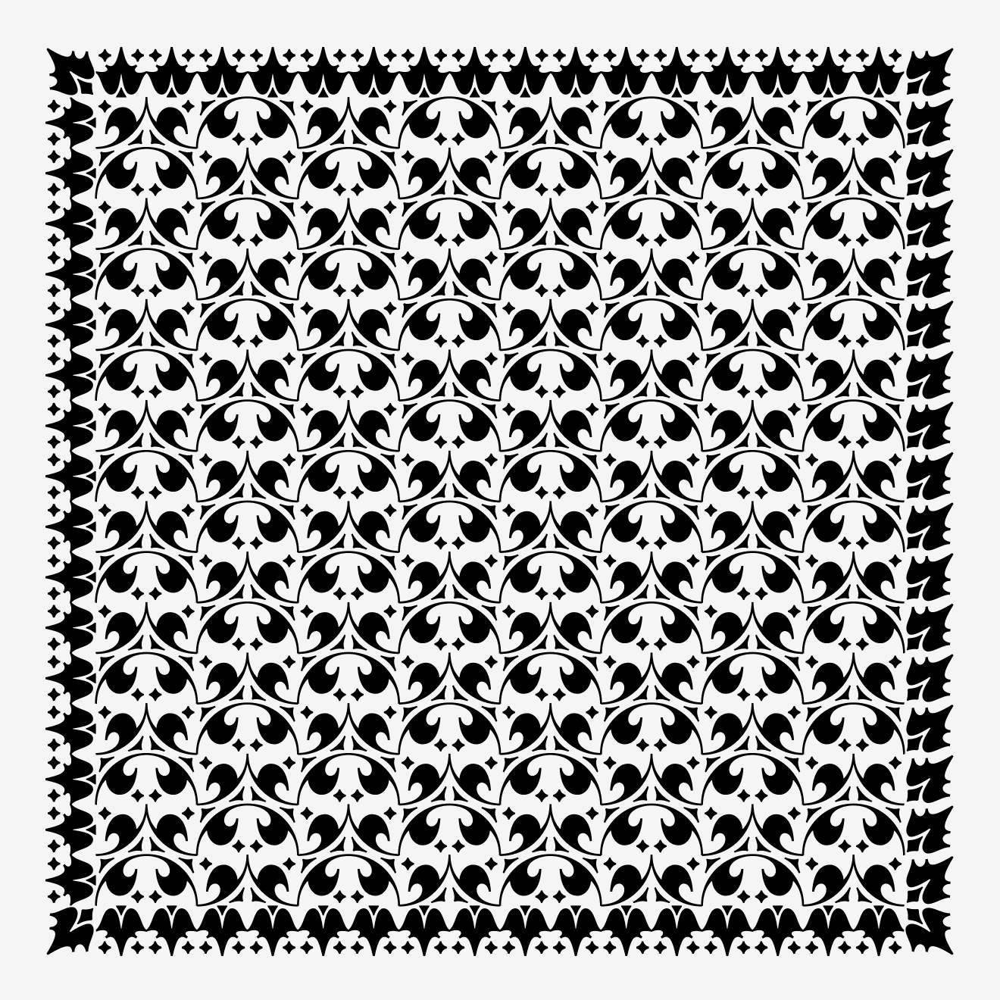

This is a companion repository for my typeface Fern Ornaments, which is available [Font of the Month Club June 2021 issue](https://djr.com/font-of-the-month-club#2021-06) along with Fern Text. [Read more about the typeface &raquo;](https://djr.com/notes/junes-font-of-the-month-fern-text)

The python script in this repository will parse input text to create patterns and borders using Fern Ornaments with specific dimensions and size. It is meant to be run in [DrawBot](https://www.drawbot.com). 

Sample patterns are included in the `/pattern` folder; the script will run the contents of this folder if the `pattern` list in the script is emptied.

These ornaments were based on a system mentioned by Bruce Rogers, designer of the [Centaur](https://fontsinuse.com/typefaces/4899/centaur) typeface, in the book [_Paragraphs on Printing_](https://www.goodreads.com/book/show/2753924-paragraphs-on-printing). This project was also inspired by James Edmonson’s [Hobeaux Rococeaux borders script](https://www.youtube.com/watch?v=dwn0M0GSVY0) as well as [Marina Chaccur’s recent talk](https://vimeo.com/482423074) on the [Kaba ornament](https://www.alphabettes.org/marina-loves-the-kaba-ornament/). 

## The Ornament Layout

In the Fern Ornaments font, different shapes are mapped to letters, meant to be easily typed on a QWERTY keyboard. This allows you to easily find reflecting forms by typing adjacent keys.

When available, lowercase letters will display undotted variants of the same form.

### Leaves

```
Q W E  q w e
A   D  a   d
Z X C  z x c
```
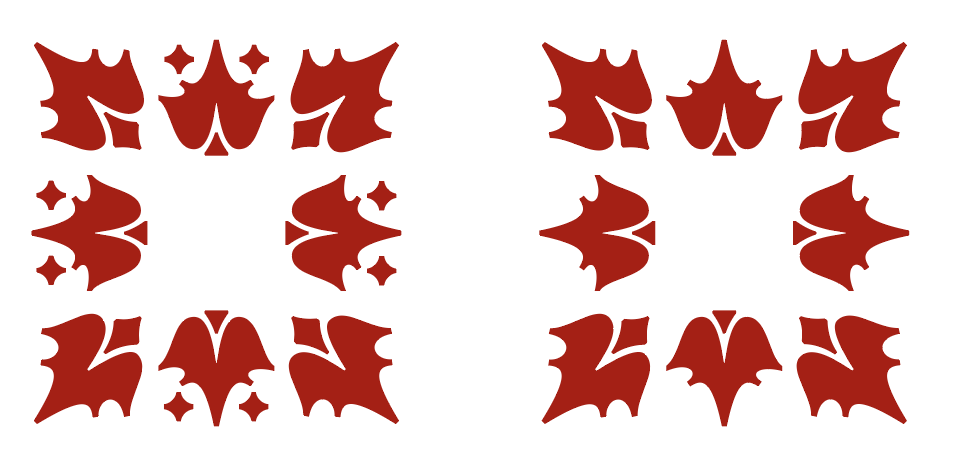

### Arcs
```
R T  r t
F G  f g
```


### Swoops
```
Y U  y u
H J  h j
```
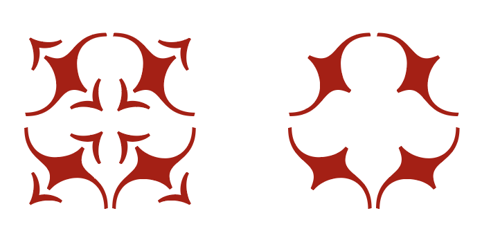


### Semicircles
```
    I O P
      L
B V
```


### Special characters

`S` and wordspace (` `) will add space equal to a character. Lowercase `s` is a half-space.

In the DrawBot script, asterisk (`*`) is a special character that separates a border element from the main repeating element.

## Using the script

When using the Fern Ornaments font, I recommend setting the line-height to 100% so that spacing is the same horizontally and vertically.

### Basic settings

The two main settings in the script are `baseWidth`, the width of the document, and `cells`, the number of cells. If you would like to specify different values for width and height, you can use `cellsXY`. The document height will be automatically calculated using the font size, number of cells, and the margin.

### Writing patterns

A pattern will repeat until it runs out of cells. For example, these two arcs facing each other.

```
RT
```
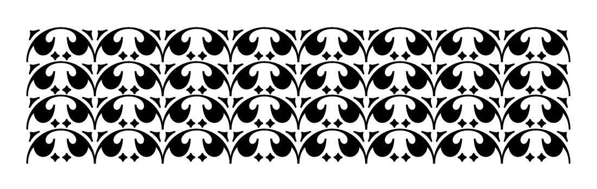

Using lowercase instead of uppercase will give you undotted versions of the shapes, when available.

```
rt
```
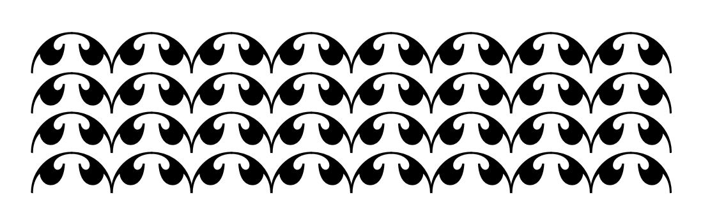

Alternatively, moving the `R` one key position down to `F` will use the flip of that letter, creating a very different pattern.

```
FT
```


Pattern lines can have prefixes and suffixes, helpful in making borders. These are delimited by an asterisk.

```
A*RT*D
```
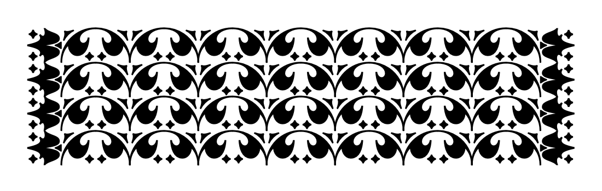

You can add more lines to increase the complexity of the repeating sequence.

```
A*RT*D
A*FG*D
```

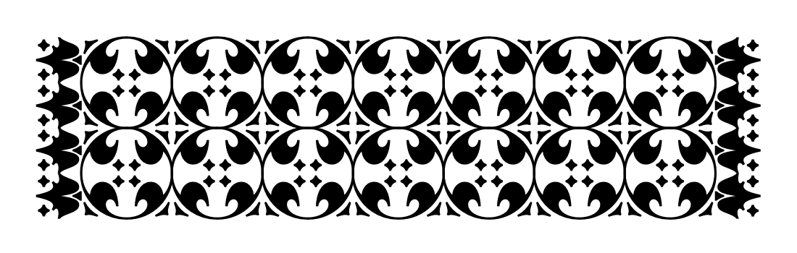

Just as each line can have a prefix and suffix, your pattern can also have prefix and suffix lines to represent the top and bottom of a border. These are delimited by a line with asterisks. Note that all lines do not have to have the same number of repeating characters.

```
Q*W*E
******
A*RT*D
A*FG*D
******
Z*X*C
```
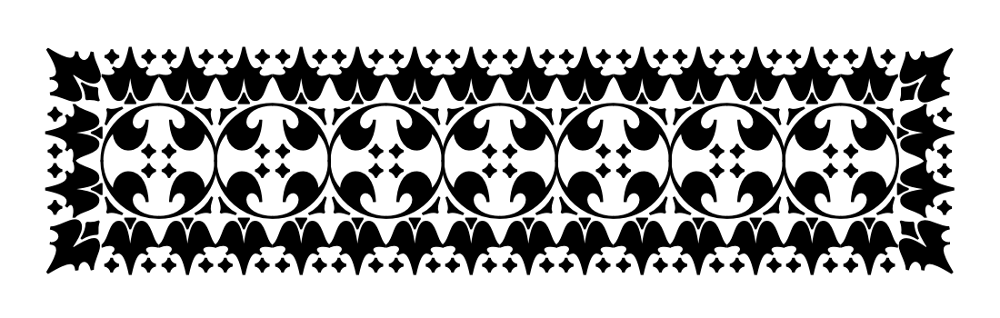


You can use `S` or the wordspace to add empty space to the inside or outside of patterns. From there you can mix and match the shapes to make the patterns as complicated as you want!

```
Q*W*E
AV*O*BD
*
AI*RTYU*PD
AI*UYFG*PD
AI*YURT*PD
AI*FGUY*PD
*
AB*L*VD
Z*X*C
```
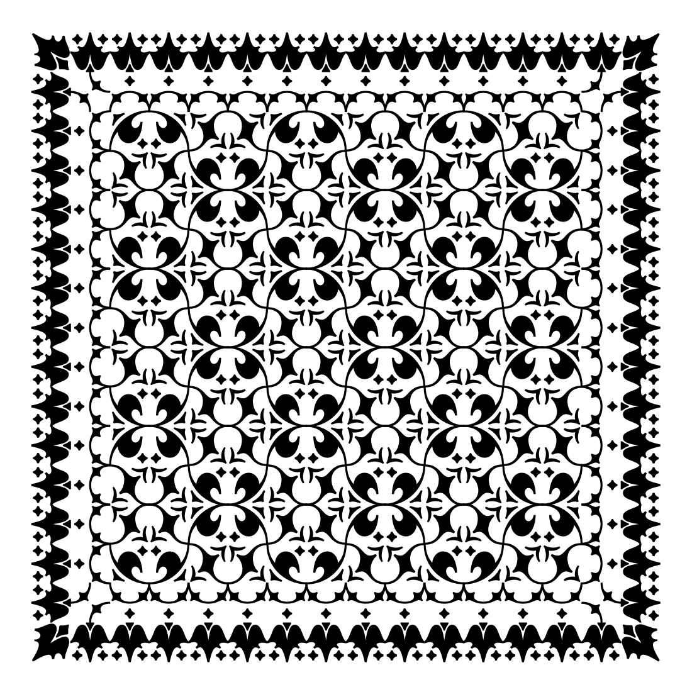

## Symmetry

In a QWERTY keyboard layout, vertical and horizontal symmetry in shapes is mapped to adjacent keys. Still it can be cumbersome to figure symmetrical keystrokes out for complex patterns, so the script contains two symmetry toggles to help automate patterns more quickly and intuitively. 

### Total symmetry

Total symmetry (`totalXSymmetry` and `totalYSymmetry` atttempts to reflect the pattern in the x and/or y direction. This allows you to write out the upper-left quarter of a pattern, and then reflect horizontally and vertically to create the whole thing. It will override any suffixes with a reflection of the prefix. 

For example, we can use prefixes and suffixes to create the upper-left quarter of a pattern with a border:

```
Q*W
*
A*JRU
```

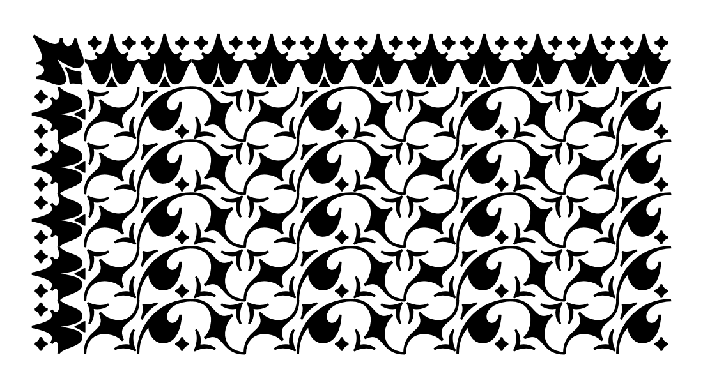

If `totalXSymmetry` and `totalYSymmetry` are set to `True`, the same pattern renders like this:

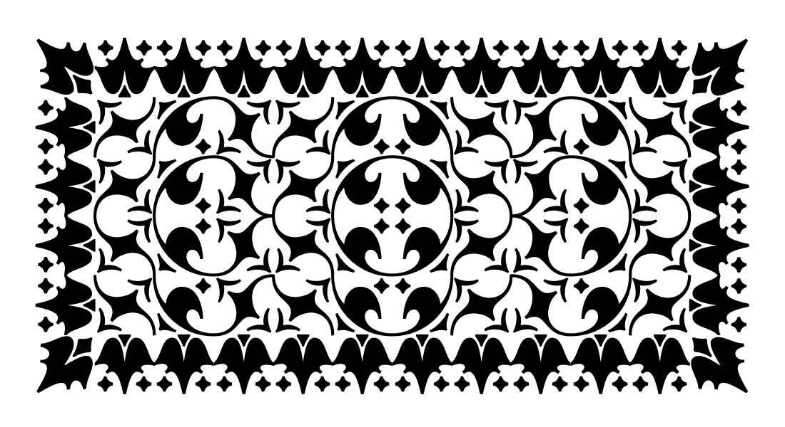

Note that patterns may not be symmetrical if the length of the pattern is not equally divisble by the number of cells! Some patterns work better with even-numbered cell counts; others with odd. 


### Local symmetry

With local symmetry, the pattern is reflected _before_ it is repeated, doubling the length of the repeating pattern but not affecting the symmetry of the pattern as a whole. Prefixes and suffixes are not affected.

If `localXSymmetry` and `localYSymmetry` are applied the previous example, the 3×1 repeating section becomes a 6×2 repeating section.

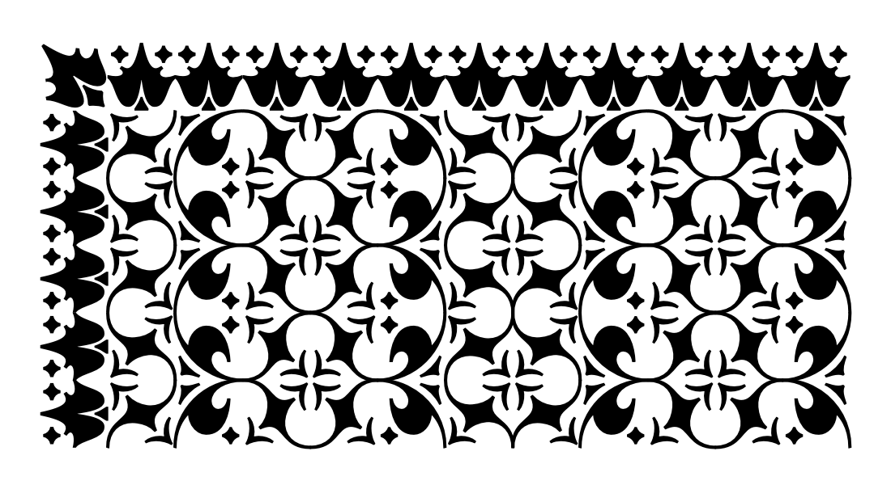

Of course, it’s also possible to apply local symmetry and total symmetry simultaneously:

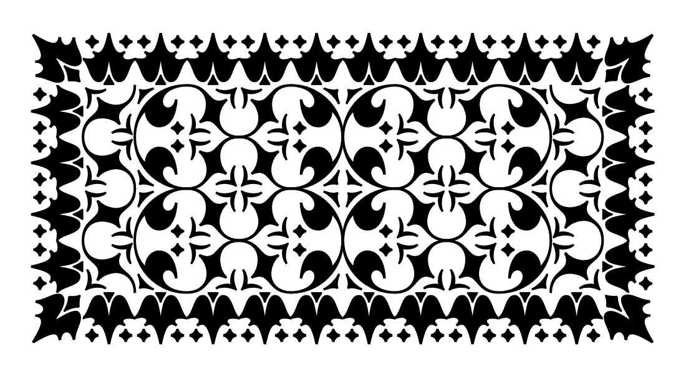
